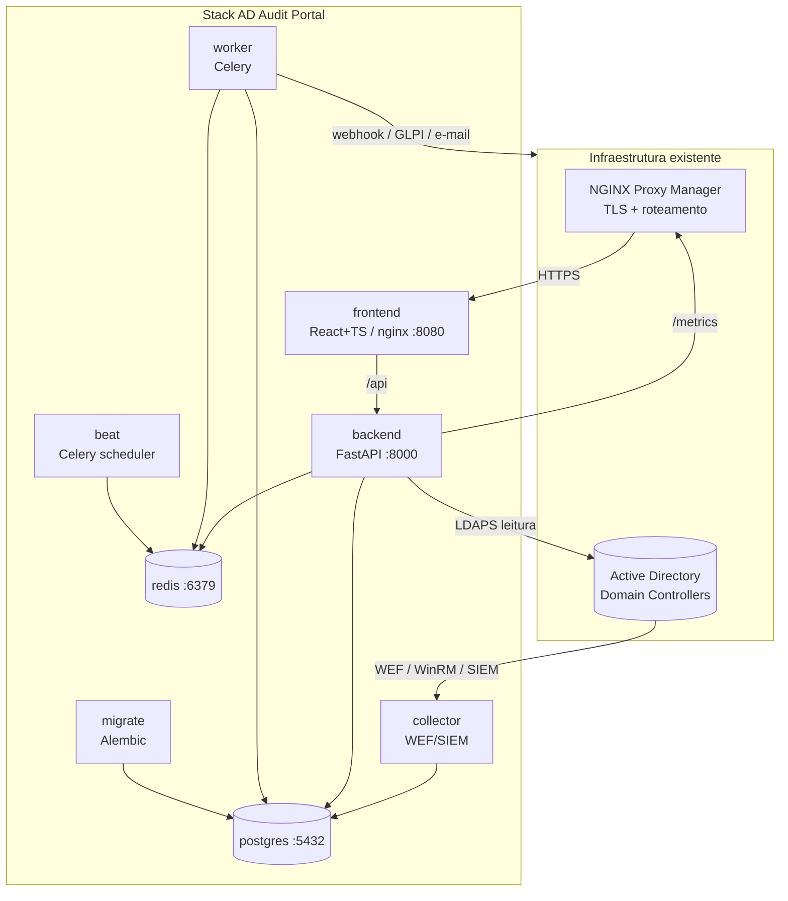
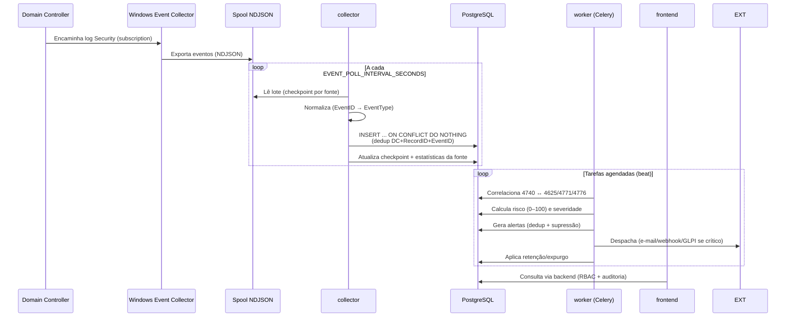

# Arquitetura

O AD Audit Portal é uma stack containerizada, **somente leitura** em relação ao
Active Directory, preparada para evoluir de Docker Compose para Docker Swarm ou
Kubernetes (serviços desacoplados, estado externalizado em Postgres/Redis,
configuração 100% por ambiente).

## Diagrama de componentes

## Fluxo de eventos

## Decisões de arquitetura

- **Separação collector/worker/backend**: a coleta é independente da API e do
  processamento; cada uma escala horizontalmente sem afetar as demais.
- **Deduplicação no banco**: o índice único `(domain_controller,
  event_record_id, event_id)` torna a ingestão idempotente — reentregas comuns
  em WEF não geram duplicatas, e o collector pode reprocessar sem risco.
- **Checkpoint por fonte** (`collection_checkpoints`): retoma a coleta do ponto
  correto após reinícios.
- **Estado externalizado**: nenhum serviço guarda estado local relevante; tudo
  vai para Postgres (dados) e Redis (fila/cache/sessão), viabilizando réplicas.
- **Configuração por ambiente** com validação no startup: o backend recusa
  iniciar se faltar variável obrigatória (ver `docs/troubleshooting.md`).
- **Somente leitura no AD**: a API não expõe operação de escrita — garantido por
  teste automatizado.

## Modelo de dados (resumo)

| Tabela | Papel |
|---|---|
| `normalized_events` | Evento canônico (todos os campos + `raw_event_json` JSONB) |
| `ad_users` / `ad_computers` / `ad_groups` | Objetos sincronizados do AD (leitura) |
| `domain_controllers` | Saúde por DC (heartbeat, último evento, lag) |
| `event_sources` | Fontes de coleta e estatísticas |
| `collection_checkpoints` | Retomada de coleta por fonte |
| `lockout_investigations` | Painel de investigação de bloqueio (4740) |
| `alerts` / `risk_rules` | Alertas e regras de risco |
| `ticket_links` / `analyst_notes` | Tickets GLPI e anotações |
| `report_exports` | Registro de exportações |
| `internal_audit_log` | Auditoria interna (login, JSON bruto, export…) |
| `retention_policies` | Política de retenção por tipo de dado |

Migrations em `backend/alembic/`. A migração inicial materializa o modelo
declarado em `backend/app/models/` (fonte única de verdade).

## Evolução para Swarm/Kubernetes

- Trocar `secrets:` de arquivo por *Docker Secrets* (Swarm) ou *Secrets/
  ExternalSecrets* (K8s).
- `frontend`, `backend`, `worker`, `collector` viram Deployments com réplicas;
  `beat` deve ter **réplica única** (scheduler).
- `postgres`/`redis` → serviços gerenciados ou StatefulSets com volumes.
- `migrate` → *Job* de pré-deploy (init container ou Helm hook).
