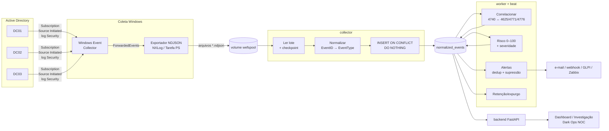
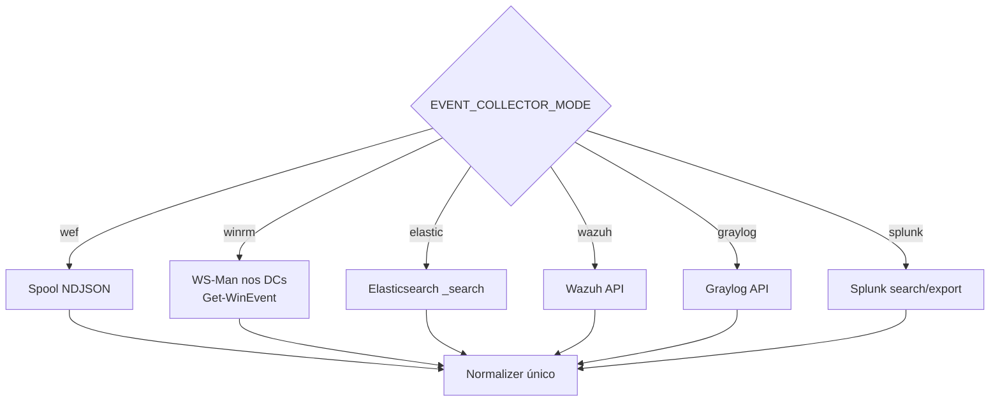

# Diagrama — Fluxo de Eventos (detalhado)

```mermaid
flowchart LR
    subgraph AD[Active Directory]
        DC1[DC01]
        DC2[DC02]
        DC3[DC03]
    end

    subgraph WIN[Coleta Windows]
        WEC[Windows Event<br/>Collector]
        EXP[Exportador NDJSON<br/>NXLog / Tarefa PS]
    end

    DC1 & DC2 & DC3 -->|Subscription<br/>Source Initiated<br/>log Security| WEC
    WEC -->|ForwardedEvents| EXP
    EXP -->|arquivos *.ndjson| SPOOL[(volume wefspool)]

    subgraph COL[collector]
        RD[Ler lote<br/>+ checkpoint]
        NORM[Normalizar<br/>EventID → EventType]
        DEDUP[INSERT ON CONFLICT<br/>DO NOTHING]
    end

    SPOOL --> RD --> NORM --> DEDUP --> PG[(normalized_events)]

    subgraph WORK[worker + beat]
        CORR[Correlacionar<br/>4740 ↔ 4625/4771/4776]
        RISK[Risco 0–100<br/>+ severidade]
        ALERT[Alertas<br/>dedup + supressão]
        RET[Retenção/expurgo]
    end

    PG --> CORR --> PG
    PG --> RISK --> PG
    PG --> ALERT --> INT[e-mail / webhook / GLPI / Zabbix]
    PG --> RET

    PG --> API[backend FastAPI]
    API --> UI[Dashboard / Investigação<br/>Dark Ops NOC]
```

## Modos de coleta alternativos

Quando WEF não estiver disponível, o `collector` suporta (via
`EVENT_COLLECTOR_MODE`):

```mermaid
flowchart TB
    MODE{EVENT_COLLECTOR_MODE}
    MODE -->|wef| WEF[Spool NDJSON]
    MODE -->|winrm| WINRM[WS-Man nos DCs<br/>Get-WinEvent]
    MODE -->|elastic| ELK[Elasticsearch _search]
    MODE -->|wazuh| WZ[Wazuh API]
    MODE -->|graylog| GL[Graylog API]
    MODE -->|splunk| SP[Splunk search/export]
    WEF & WINRM & ELK & WZ & GL & SP --> N[Normalizer único]
```
